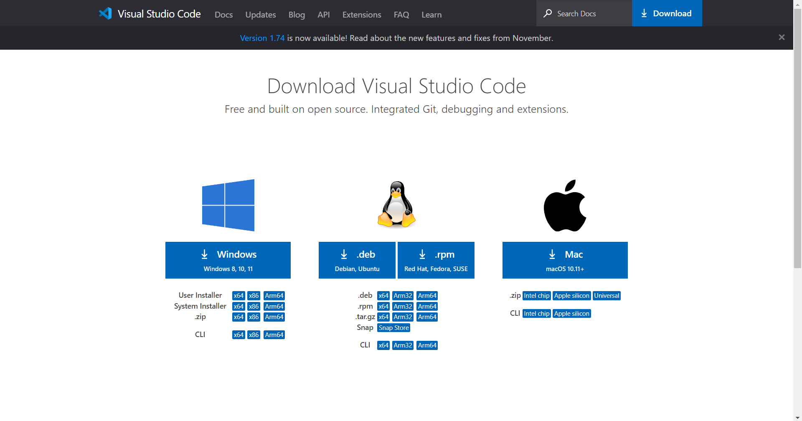
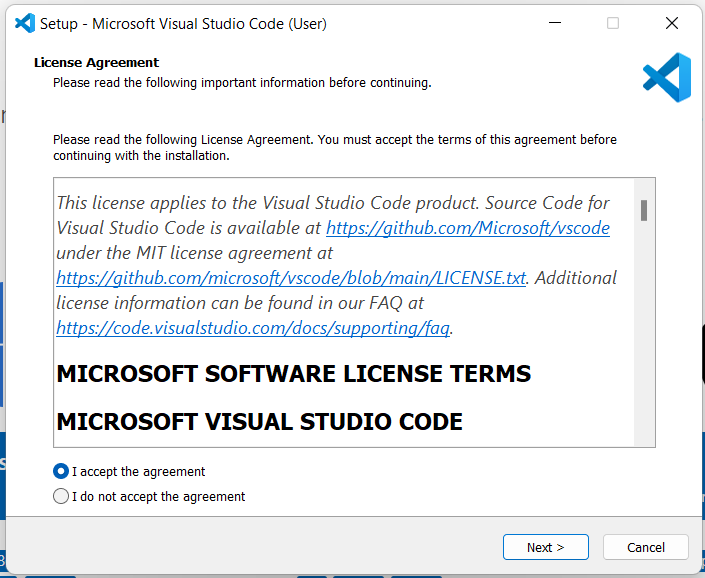

# CSE 15L Tutorial

Welcome to CSE 15L! This is a short tutorial on how to get started with this lab. We will be covering how to:
- Install Visual Studio Code
- Remotely connect to a computer in the CSE basement using ieng6
- Trying some commands on the client and server

## Installing Visual Studio Code

First head to [https://code.visualstudio.com/download](https://code.visualstudio.com/download).
Here you will find different installations for Visual Studio Code for different operating systems (Windows, macOS, Ubuntu, etc.) 

Download the installation for your operating system. In my case it's Windows.

Next, run the .exe installer and follow the instructions.

Once the installation is complete you can now open Visual Studio Code, and you should see a screen like this:

You have now installed Visual Studio Code!

## Establishing a remote connection using ieng6

If this is the first time using your CSE 15L account, lookup your account at [https://sdacs.ucsd.edu/~icc/index.php](https://sdacs.ucsd.edu/~icc/index.php) and reset your password to activate your account. You will use this password to login to the remote server.

Before leaving this page, note the last 3 letters of your CSE 15L account ID. You will need this in the future.

Install Git at [https://gitforwindows.org/](https://gitforwindows.org/), run the .exe installer, and follow the instructions you see on the window. Once you have successfully downloaded and installed git, open Visual Studio Code and hold Crtl + \` to open the terminal.

Next open the command palette using Crtl + Shift + P and type "Select Default Profile". Then select Git Bash fom the options. On the top right side of the terminal window, click on the + icon. This will open a new Git Bash terminal. Give it a few seconds to load.

You should now see something like this:

Next, to establish a connection with the server, type `$ ssh cs15lwi23zz@ieng6.ucsd.edu` in your terminal. Do not hit enter just yet. Replace the "zz" with the letters from your CSE 15L account as noted above, and then press enter.

If this is your first time establishing a connection to the server, you should see a message like this: 
`ssh cs15lwi23zz@ieng6.ucsd.edu
The authenticity of host 'ieng6.ucsd.edu (128.54.70.227)' can't be established.
RSA key fingerprint is SHA256:ksruYwhnYH+sySHnHAtLUHngrPEyZTDl/1x99wUQcec.
Are you sure you want to continue connecting (yes/no/[fingerprint])? `

Type `yes` and press enter. Then type in your password and press enter (you won't see it when typing for privacy reasons).

If successful, your terminal should look similar to this:

Great! Your terminal is now connected to a computer in the CSE basement! Any commands you run on the terminal will run on this computer.

## Running Commands

You can now run commands on the remote computer. Try it out. Here are some examples.

`pwd` shows you what your current/working directory is. I ran this on the first line in the image above, and it shows that I'm in the home directory `/home/linux/ieng6/cs15lwi23/cs15lwi23afv`.

`ls` is used to list all the files and directories inside the current directory.

Here's another command I ran: `cat /home/linux/ieng6/cs15lwi23/public/hello.txt`. This is known as the concatenate command. It reads data from the hello.txt file and outputs it in the terminal.
Next I ran `cp /home/linux/ieng6/cs15lwi23/public/hello.txt ~/`, which copied the hello.txt file from the cs15lwi23/public directory into my home directory (cs15lwi23/cs15lwi23afv).

`cd` is used to change directories. When I ran `cd perl5`, it opened up the perl5 directory. You can see that this worked when the current path was output once I ran the `pwd` command (/home/linux/ieng6/cs15lwi23/cs15lwi23afv/perl5).
You can run `cd ..` to go to the previous directory.
`cd ~` can be used to return to your home directory.

Next I opened the wavelet directory and ran the command `ls -lat`. This lists all the files in the working directory along with details including read/write permissions, its path, date and time modified, etc.

Also try running some commands on your local computer. To close the remote connection, type `exit` in the terminal.
Run simillar commands to the ones shown above in your local directory.
